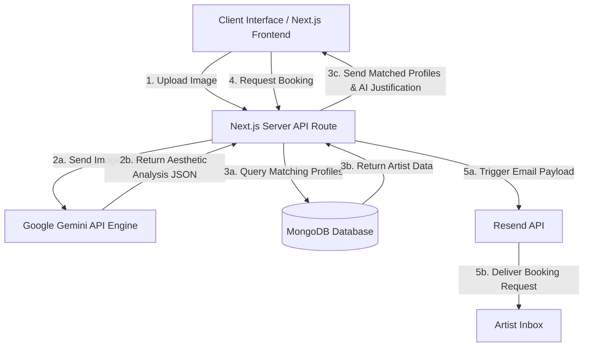

# Kajal Cartel

## Live Production Environment

Access the live application deployment: [kajal-cartel.vercel.app](https://kajal-cartel.vercel.app/)

---

## 1. Project Overview

Finding the right makeup artist for a wedding is a fragmented, inefficient process. Brides spend weeks manually filtering through social media, guessing if an artist has the technical skill to recreate a specific vision. Artists, on the other hand, waste hours managing inquiries from leads that do not align with their specialized aesthetic.

Kajal Cartel is a systemic solution to this market inefficiency. Built as a high-complexity, infrastructure-grade platform, it replaces manual searching with an agentic AI matchmaking engine. By analyzing the core techniques in a reference image, the platform instantly pairs the demand side (brides) with the supply side (artists) based on verifiable aesthetic alignment, transparent pricing, and secure booking flows.

---

## 2. System Architecture & Data Flow Workflow

The platform operates on a tightly integrated stack, moving data securely between the client interface, the server-side logic, the artificial intelligence engine, and the database.

### High-Level Architecture Diagram



### Step-by-Step Workflow Execution

1. **Input Phase:** The user uploads a target image to the client interface. The image is converted into a secure payload and sent to the server.
2. **Analysis Phase:** The server forwards the payload to the Gemini API. The AI acts as a domain expert, analyzing the image for specific variables: skin finish (matte vs. dewy), eye styling (smoky vs. graphic), and color palettes.
3. **Query Phase:** The AI returns a structured JSON object defining these traits. The server uses this data to query the MongoDB database for artists whose tagged specialties match the AI's output.
4. **Justification Phase:** The server synthesizes the database results with the AI's reasoning, sending a unified response back to the client. The user sees not just who matches, but specifically why they match.
5. **Transactional Phase:** When a user initiates a booking, the server verifies their NextAuth session and triggers the Resend API to deliver a formatted email directly to the selected artist.

---

## 3. Core Use Cases

### Demand Side (The Client/Bride)

* **Visual Discovery:** A user does not need to know industry terminology. They simply upload a photo, and the system translates the visual data into technical search parameters.
* **Cost Transparency:** A user can input their exact event requirements (e.g., one bridal session, two guest sessions) into the dynamic calculator on an artist's profile to instantly generate a baseline cost without waiting for a manual quote.
* **Stateful Journey Tracking:** A user logs in via Google OAuth. As they discover matching artists, they can save these profiles to a persistent personal dashboard for future review.

### Supply Side (The Service Provider/Artist)

* **Qualified Lead Generation:** Artists only receive booking requests from users who have been algorithmically matched to their specific style of work, ensuring a higher conversion rate.
* **Automated Intake:** Booking requests arrive in the artist's inbox with the client's contact information, event details, and the specific visual reference image that triggered the match.

---

## 4. Deep Detailed Feature Breakdown

### Agentic AI Matching Engine

The core of the application relies on the Google Gemini API. Instead of relying on user-selected text filters, the AI performs a deep visual synthesis. It reads the lighting, texture, and application methods in the uploaded photo. It then generates a comparative analysis against the known data points of artists in the database, producing a natural-language justification that builds user trust before a booking is ever made.

### Dynamic Pricing Calculator

Opaque pricing is a primary failure point in service marketplaces. Kajal Cartel solves this by attaching base cost variables to each artist's database schema. The frontend component reads these variables and multiplies them against the user's real-time input (number of events, number of people) to output an immediate, reliable financial estimate.

### Secure Ecosystem Retention

The platform utilizes NextAuth for credential management. By wrapping the application in a session provider, user actions (like saving an artist or requesting a booking) are securely tied to a unique database identifier. This prevents data loss across sessions and keeps the user securely anchored within the platform's ecosystem.

---

## 5. Technology Stack

This application bypasses traditional manual development constraints by utilizing modern, infrastructure-grade tools.

* **Application Framework:** Next.js 14 (App Router architecture for server-side rendering and optimized routing).
* **Language Environment:** TypeScript (Ensuring strict type safety across the entire codebase).
* **Agentic AI:** Google Gemini API (Strictly utilized for complex image analysis and reasoning tasks).
* **Database Layer:** MongoDB with Mongoose ODM (Document-based storage for flexible artist schemas and user relations).
* **Authentication Provider:** NextAuth.js (Configured with Google OAuth and JSON Web Token session strategies).
* **Transactional Communications:** Resend API (For reliable, low-latency email delivery).
* **Interface Rendering:** Tailwind CSS (Utility-first styling) and Framer Motion (Complex state animations).
* **Deployment Infrastructure:** Vercel (Edge network hosting and continuous integration).

---

## 6. Local Development Setup Instructions

To deploy and modify this system in a local environment, execute the following steps strictly in order.

### System Prerequisites

* Node.js installed (Version 18.x or higher recommended).
* A registered Google Cloud Console project (for OAuth credentials).
* A Google AI Studio account (for the Gemini API key).
* A MongoDB Atlas cluster or a local MongoDB instance.
* A Resend account with a verified sending domain.

### Installation Process

1. **Clone the Repository:** Download the source code to your local machine and navigate into the root directory via your terminal.
2. **Install Dependencies:** Execute the package manager. Note: The `--legacy-peer-deps` flag is required to bypass known strict dependency conflicts between the current version of NextAuth and MongoDB version 6 adapters.

```bash
npm install --legacy-peer-deps

```

3. **Configure Environment Variables:** Create a file named `.env.local` in the root directory. This file must contain the secure routing keys for the infrastructure to function. Do not commit this file to version control.

```env
# AI & Database Infrastructure
GEMINI_API_KEY=your_google_ai_key_here
MONGODB_URI=your_mongodb_connection_string

# Authentication Security (NextAuth)
NEXTAUTH_URL=http://localhost:3000
NEXTAUTH_SECRET=generate_a_random_32_character_string

# Google OAuth Provider Credentials
GOOGLE_CLIENT_ID=your_google_cloud_client_id
GOOGLE_CLIENT_SECRET=your_google_cloud_client_secret

# Email Infrastructure
RESEND_API_KEY=your_resend_api_key
ADMIN_EMAIL=your_verified_resend_email_address

```

4. **Initialize Database State:** Populate your blank database with the baseline artist profiles required for the matching algorithm to function.

```bash
npx tsx src/lib/db/seed.ts

```

5. **Launch the Application:** Boot the local development server.

```bash
npm run dev

```

6. **Verify Deployment:** Open a web browser and navigate to `http://localhost:3000` to confirm the system is operational.
